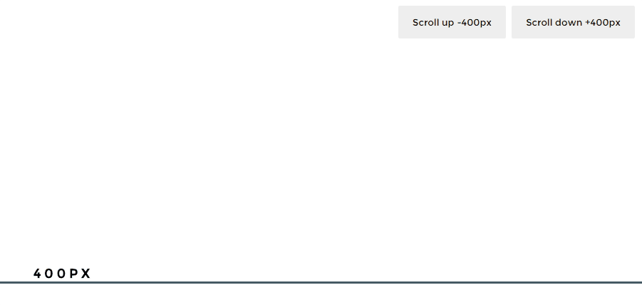

# scroll-to

[![Build status][travis-image]][travis-url]
[![Git tag][git-image]][git-url]
[![NPM version][npm-image]][npm-url]
[![Code style][standard-image]][standard-url]

Imperatively smooth scroll to the given y-coordinates.



## Installation

    $ npm install @f/scroll-to

## Usage

```js
var scrollTo = require('@f/scroll-to')

// scroll to y-coordinates `100` with a duration of `500` and a
// custom easing function
scrollTo(100, 500, easeOutQuint)
```

## API

### scrollTo(y, duration, easing, offset)

- `y` - Position to move to.
- `duration` - Duration of the scrolling animation.
- `easing` - Custom easing function. Defaults to a linear function (`t => t`).
- `offset` - Scroll offset position. Defaults to `window.scrollY`.

## License

MIT

[travis-image]: https://img.shields.io/travis/micro-js/scroll-to.svg?style=flat-square
[travis-url]: https://travis-ci.org/micro-js/scroll-to
[git-image]: https://img.shields.io/github/tag/micro-js/scroll-to.svg?style=flat-square
[git-url]: https://github.com/micro-js/scroll-to
[standard-image]: https://img.shields.io/badge/code%20style-standard-brightgreen.svg?style=flat-square
[standard-url]: https://github.com/feross/standard
[npm-image]: https://img.shields.io/npm/v/@f/scroll-to.svg?style=flat-square
[npm-url]: https://npmjs.org/package/@f/scroll-to
